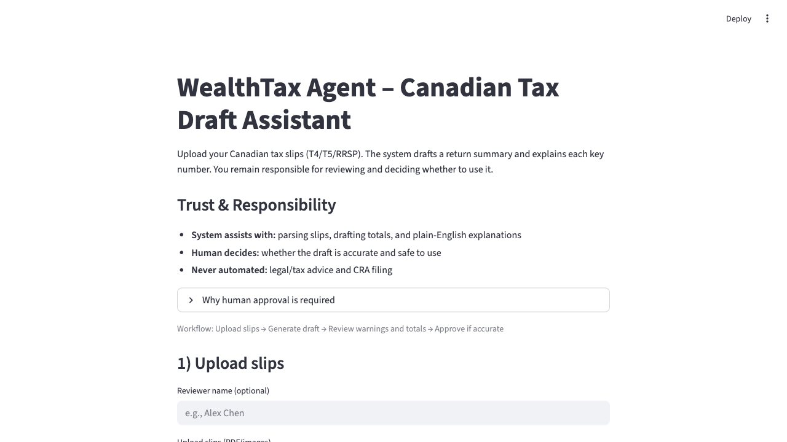
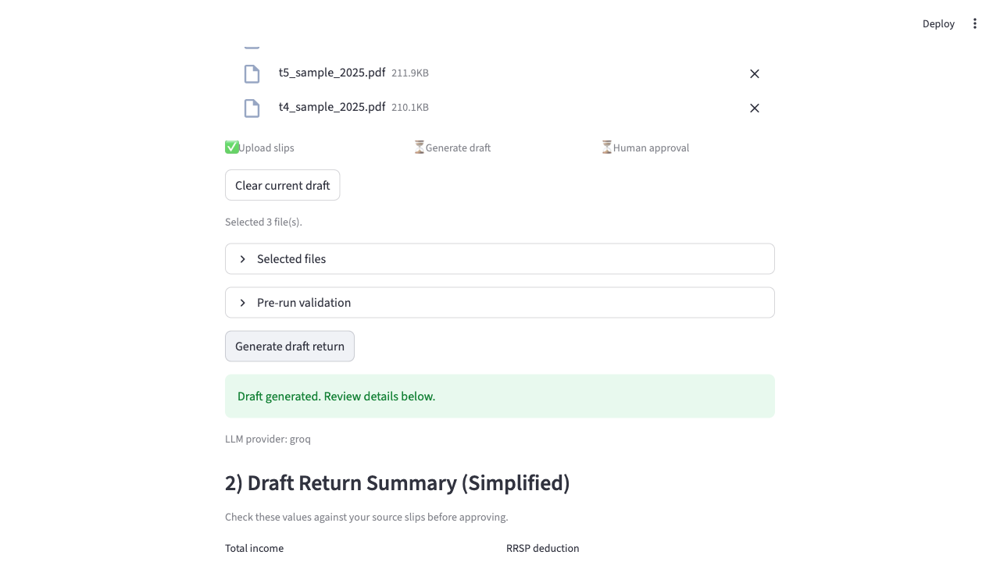
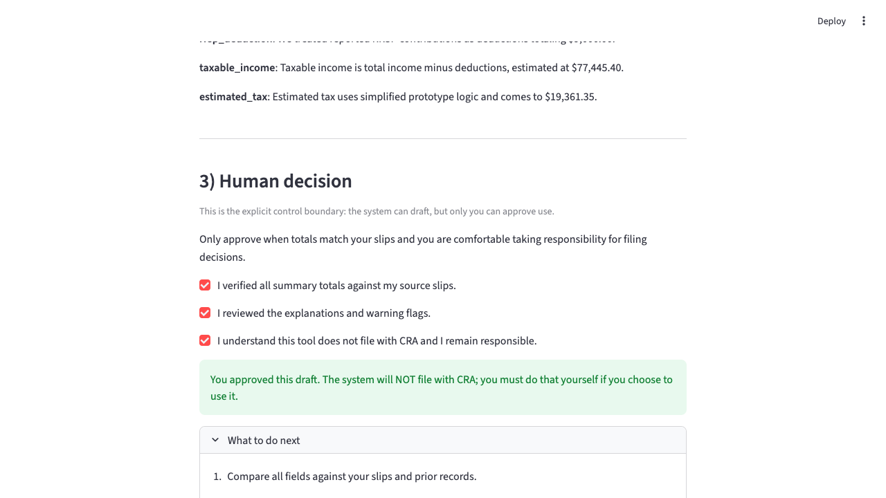

# WealthTax Agent – Canadian Tax Draft Assistant

This is a prototype built for the Wealthsimple builder challenge.
It redesigns the Canadian personal tax workflow using a modern, human-centered system.

## What it does

- Lets a user upload Canadian tax slips (T4/T5/RRSP receipts).
- Parses unstructured slips into structured data.
- Applies simplified Canadian tax logic to build a draft return.
- Generates plain-English explanations for each key number.
- Produces downloadable draft artifacts from the same run:
  - Human-readable draft summary (`.txt`)
  - Pseudo-XML draft representation (`.xml`)
- Presents a UI where the **human must decide** whether to approve the draft.
- Explicitly does **not** file with CRA; filing remains entirely human.

This demonstrates:
- Automation taking on complex document understanding, reasoning, and explanation work.
- A redesigned workflow compared to manual entry + CRA auto-fill in Wealthsimple Tax.
- A clear, legally grounded human decision boundary (signing/filing the return).

## Quickstart

### 1. Prerequisites

- Python 3.10+
- A Groq API key (free tier)

Set provider mode and key:

  ```bash
  export LLM_PROVIDER=groq
  export GROQ_API_KEY=gsk-...
  ```

Optional endpoint/model overrides:

  ```bash
  export GROQ_BASE_URL=https://api.groq.com/openai/v1
  export OPENAI_BASE_URL=https://api.groq.com/openai/v1
  export OCR_MODEL=meta-llama/llama-4-scout-17b-16e-instruct
  export PARSE_MODEL=llama-3.1-8b-instant
  export EXPLAIN_MODEL=llama-3.1-8b-instant
  export LOCAL_OCR_ONLY=false
  export MAX_UPLOAD_FILES=20
  ```
  
`LOCAL_OCR_ONLY=true` forces local OCR-only behavior. For image uploads this requires a local OCR backend (e.g., `tesseract`) to be installed.

### 2. Install dependencies

```bash
pip install -r requirements.txt
```

### 3. Run the UI

```bash
PYTHONPATH=src python -m streamlit run src/wealthtax_agent/main.py
```

Then open the URL shown in your terminal (by default http://localhost:8501).

### 4. One-command validation (tests + app boot)

```bash
./scripts/validate.sh
```

Optional: override Python binary or key for local runs.

```bash
PYTHON_BIN=$PWD/.venv/bin/python GROQ_API_KEY=gsk-... ./scripts/validate.sh
```

### 5. Using the app

1. Prepare 2–20 slips (T4/T5/RRSP) as PDFs or images.
2. Upload them via the file uploader.
3. Click **"Generate draft return"**.
4. Review the computed totals and explanations.
5. Click **"Approve this draft (I take responsibility)"** if you would be comfortable using it.

The system will not contact CRA; it only produces a draft for demonstration.

### 6. Sample files + end-to-end tests

- Sample upload files (realistic formats): `sample_tax_slips/*.pdf`, `sample_tax_slips/*.png`, `sample_tax_slips/*.jpg`, `sample_tax_slips/*.jpeg`
- Fixture-based end-to-end test: `tests/integration/test_pipeline_with_synthetic_fixture.py`
- Format coverage test: `tests/integration/test_supported_file_formats.py`

Run all validation (tests + app boot):

```bash
./scripts/validate.sh
```

Regenerate realistic sample files and validate all upload formats:

```bash
./scripts/regen_and_test_samples.sh
```

Validation history is automatically appended to:

```bash
docs/run_history.md
```

### Adding Screenshots

To further document the workflow, you can add screenshots of:
- The Streamlit UI after uploading slips and generating a draft return.
- The validation output in your terminal.

**How to add screenshots:**
1. Take a screenshot (Cmd+Shift+4 on Mac, or use your OS tool).
2. Save the image in the `docs/` folder (e.g., `docs/ui_screenshot.png`).
3. Embed it in the README:

```markdown

```

Repeat for any other key screens you want to showcase.

---

## 📸 UI Screenshots: End-to-End Flow

Below are placeholders for screenshots demonstrating the full user flow in the WealthTax Agent Streamlit UI. To complete this section, follow the instructions below and add your screenshots to the `docs/` folder.

### 1. Launch & Upload Tax Slips

*User launches the app and uploads sample tax slips (PDF, PNG, JPG, JPEG).*

### 2. Review Extracted Slips

*The UI displays parsed slips and extracted data for user review.*

### 3. Generate Draft Return

*The draft tax return is generated and shown, with key values highlighted.*

### 4. Approve & Download

*User approves the draft and can download the completed return.*

---

## 📷 How to Add or Update Screenshots

1. Launch the Streamlit UI: `streamlit run src/wealthtax_agent/main.py`
2. Walk through the full flow (upload, review, generate, approve).
3. Take screenshots at each step and save as:
   - `docs/step1_upload.png`
   - `docs/step2_review_slips.png`
   - `docs/step3_draft_return.png`
   - `docs/step4_approve.png`
4. Screenshots will be automatically displayed above.

---

## Engineering docs

- Architecture: `docs/architecture.md`
- Demo script: `docs/demo_runbook.md`
- Demo voiceover: `docs/demo_voiceover.md`
- Submission draft: `SUBMISSION.md`
- Submission checklist: `SUBMISSION_CHECKLIST.md`

## Project structure

```text
wealthtax-agent/
  src/
    wealthtax_agent/
      __init__.py
      main.py          # Streamlit UI
      graph.py         # LangGraph graph assembly
      state.py         # Shared state (slips, draft return, explanations)
      parse_docs.py    # Slip parsing (rule-based first, model fallback)
      reason_tax.py    # Simplified tax reasoning
      build_return.py  # Placeholder for T1 mapping
      explain_return.py # Plain-language explanations
      llm.py           # Provider config + client + retry helpers
  tests/
  docs/
  requirements.txt   # Python dependencies
  README.md
```

## Design notes

- **Scope is intentionally narrow**: only a few slip types (T4/T5/RRSP) and simplified tax logic.
- This keeps the prototype buildable in under a week on a laptop while still being realistic.
- The system focuses on:
  - Replacing manual data entry and mental reconciliation.
  - Providing explanations that improve user understanding and decision quality.
  - Making the human decision point explicit and non-delegable.

## Extending the prototype

Ideas for future work (and "what breaks at scale"):

- Support more slip types (T3, T5008, foreign income).
- Integrate CRA Auto-fill data and reconcile against user-uploaded slips.
- Add RAG over the CRA T1 guide and Income Tax Folios for more accurate reasoning.
- Model multiple provinces, Québec dual filing, and more precise tax brackets.
- Track RRSP room and carry-forward losses using prior NOAs.

